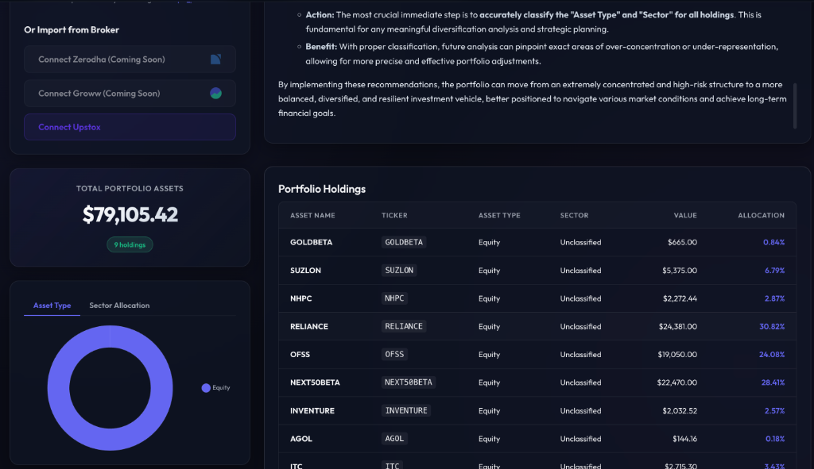
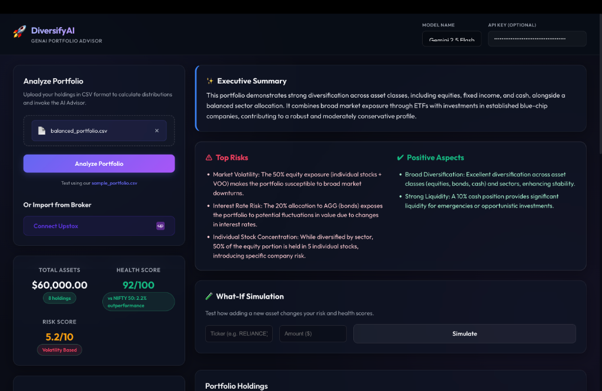

# DiversifyAI — GenAI Portfolio Diversification Analyzer

A modern, high-fidelity Web Application and API that analyzes your investment portfolio using Google's Gemini generative AI models. The system features a responsive, beautifully styled dark dashboard layout complete with drag-and-drop file upload, interactive animated doughnut charts, a custom Holdings list, and real-time advisory reports.

## Features

- **Sleek Web UI**: Dashboard built with modern glassmorphic Vanilla CSS styling and high contrast HSL variables.
- **FastAPI Backend**: Built using FastAPI, with standard endpoints supporting file uploads in-memory.
- **Visual Data breakdown**: Interactive, clean doughnut charts rendering your allocations dynamically using `Chart.js`.
- **Markdown Advisory Reporting**: Generates a professional advisor report from Gemini (`gemini-2.5-flash`) rendered beautifully into HTML using `marked.js`.
- **Flexible Keys**: Supports server-side configuration using `.env` or secure user-supplied keys directly through the UI.
- **Legacy CLI Option**: Includes the original command-line script (`src/main.py`) for offline operations.

---

## Directory Structure

```
Sample/
├── .env.template             # Template environment variables (GEMINI_API_KEY)
├── requirements.txt          # Python packages (fastapi, pandas, google-generativeai, etc.)
├── README.md                 # Project guide and instructions
├── data/
│   └── sample_portfolio.csv  # Example portfolio to get you started
└── src/
    ├── __init__.py
    ├── analyzer.py           # Core logic (CSV loader & Gemini API integration)
    ├── app.py                # NEW: FastAPI web server and routing
    ├── main.py               # Command-line entrypoint
    └── static/               # NEW: Premium frontend dashboard
        ├── index.html        # Glassmorphism HTML layout
        ├── styles.css        # Dashboard styling system
        └── app.js            # Interactive logic & Chart.js orchestration
```

---

## Setup Instructions

### 1. Prerequisites
Make sure you have Python 3.8+ installed on your system.

### 2. Navigate and Create Virtual Environment
Open your terminal and run:
```bash
cd "/Users/aryanbarnwal/Projects/GenAI Project/Sample"
python3 -m venv venv
source venv/bin/activate
pip install -r requirements.txt
```

### 3. Set Up API Key
Copy the `.env.template` to `.env`:
```bash
cp .env.template .env
```
Open `.env` and paste your Google Gemini API key:
```env
GEMINI_API_KEY=AIzaSy...
```
*(If you do not have an API key, you can get one from [Google AI Studio](https://aistudio.google.com/). You can also paste it directly into the web UI during analysis.)*

---

## Running the Web Application

To launch the web dashboard server:
```bash
python src/app.py
```
Or use `uvicorn`:
```bash
uvicorn src.app:app --reload --port 8000
```

Open **`http://localhost:8000`** in your browser!
1. Drag and drop the `data/sample_portfolio.csv` file (or upload your own).
2. Enter a custom key in the header (optional).
3. Click **"Analyze Portfolio"** to view interactive allocation charts and your personalized financial advice.

---

## Running the CLI Version (Alternative)

If you prefer operating directly in your terminal:
```bash
python src/main.py data/sample_portfolio.csv
```

---

## Usage Guide & Screenshots

The application provides a fully interactive dashboard to manage and analyze your portfolio. 

### 1. Dashboard Overview
When you start the application, you'll be greeted with the main dashboard. Here, you can view your total assets, allocation breakdown, and holdings table.



### 2. Connect Broker or Upload CSV
You have two ways to import your portfolio:
- **Broker Integration:** Click on **"Connect Upstox"** to securely authenticate and fetch your live holdings.
- **CSV Upload:** Drag and drop your `sample_portfolio.csv` into the analyze panel.

### 3. AI Analysis & Health Scores
Once your holdings are loaded, the application will compute your overall **Health Score** and **Risk Score**. The backend will then consult the AI model to generate an **Executive Summary**, highlight **Top Risks**, and outline **Positive Aspects**.



### 4. What-If Scenarios & Chat
- Scroll down to try the **What-If Simulation** to see how adding new stocks affects your overall portfolio diversification.
- Use the **AI Chat** interface to ask customized questions about your investments directly to the LLM (e.g., "Which of my stocks has the highest beta?").
